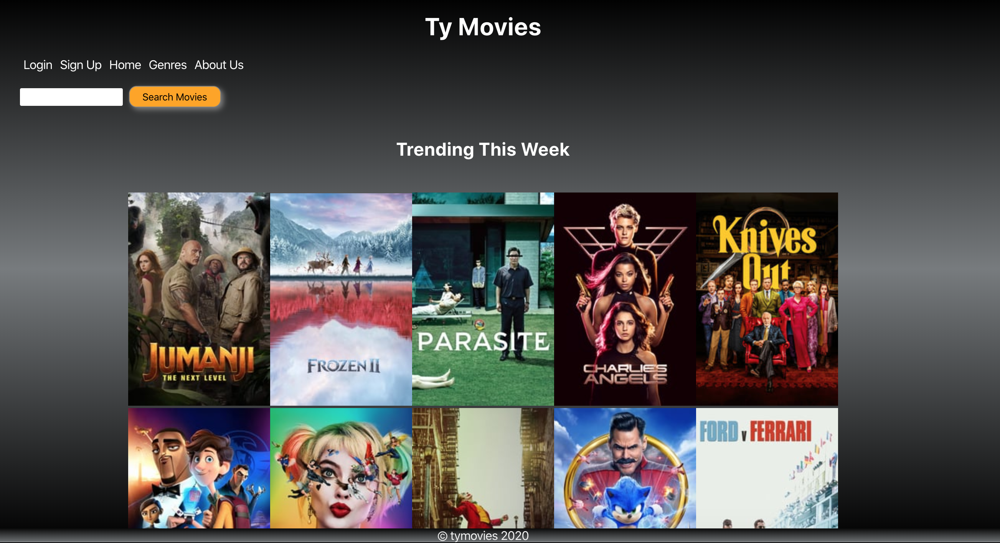

# TYMovies-DB
TYMovies-DB front end application made using The Movie Database API. Built with react.
Not endorsed or certified from TMDb.
Try it out here: https://yanni00.github.io/tymovies-frontend/#/

Some of the stuff used:

react
knock gem
rack-cors gem
sass-rails gem
bcrypt gem
pry-rails
pry-byebug

rails 5.2.4
ruby 2.4.1

# Screenshot

# Getting Started

install packages in tymoviedb-frontend

npm install

Run the server

npm install

run the backend

cd into tymoviedb-server

run rails s

TMdb api documentation can be found at: https://developers.themoviedb.org/3/getting-started
